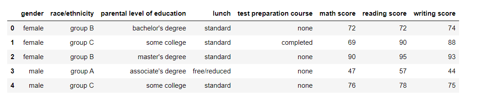
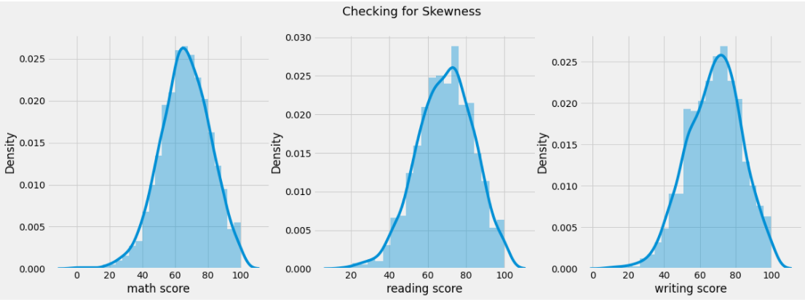
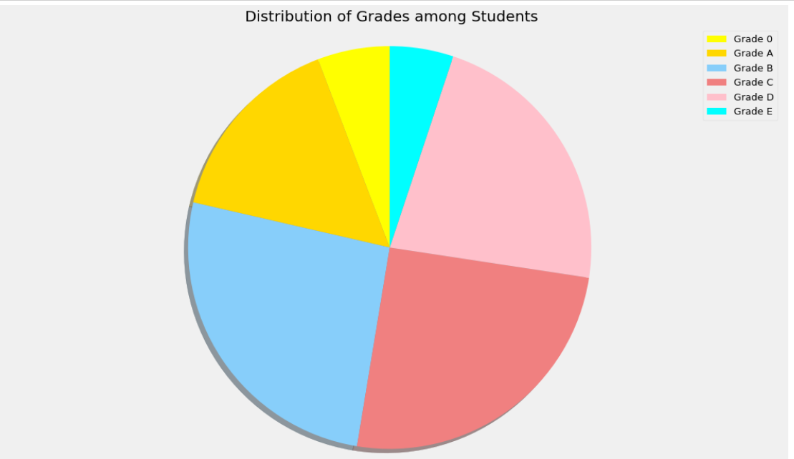
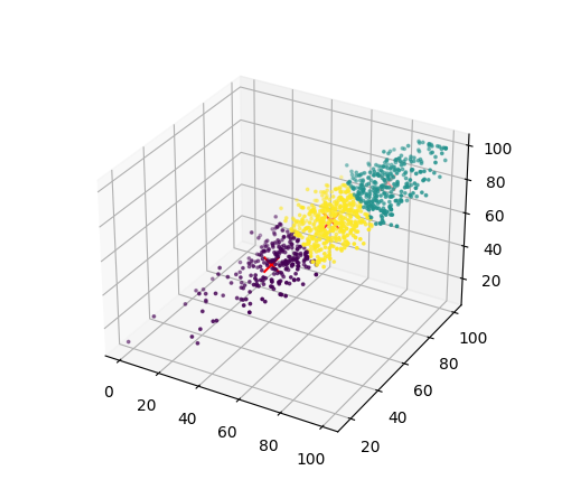

# 教学数据 机器学习策略优化

## kaggle上下载数据

## 基本的数据可视化

## 划线的等级划分

## k-means进行数据聚类

## 关联性分析

选择维度：
- 性别
- 是否提前测试过得课程
- 三科的成绩（需要离散化）
  - 离散成单科的好坏，那么产生6个项
  - 总科目的好坏
- 受教育程度

### Apriori算法

概念：
- 支持度：$support(x->y) = P(x \cap y)$
- 置信度：$confidence(x->y) = \frac_{P(x)}^{P(xy)}$

要做的工作：

1. 生成频繁项集：

这一阶段找出所有满足最小支持度的项集（具有统计学意义的组合），找出的这些项集称为频繁项集。自信度与支持度的计算涉及到多个列表的循环，极大影响频繁项集的生成时间。

2. 生成关联规则：

在上一步产生的频繁项集的基础上生成满足最小自信度的规则，产生的规则称为强规则。

两个重要推论
- 如果一个集合是频繁项集，则它的所有子集都是频繁项集。假设一个集合{A,B}是频繁项集，则它的子集{A}, {B} 都是频繁项集。
- 如果一个集合不是频繁项集，则它的所有超集都不是频繁项集。假设集合{A}不是频繁项集，则它的任何超集如{A,B}，{A,B,C}必定也不是频繁项集。

